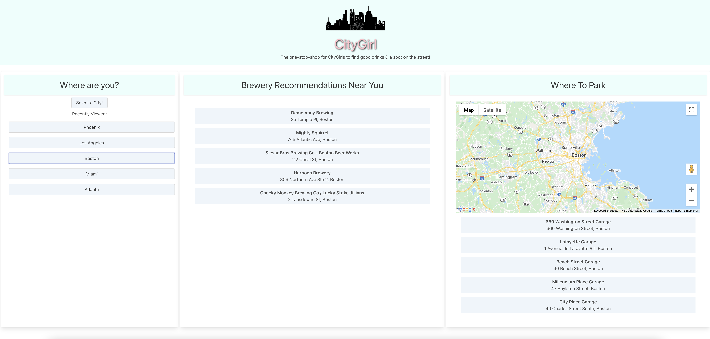

<h1 align="center">THE CODE BREAKERS</h1>
<h2 align="center">Project #1 Team #4</h2>

### 🔭 You may find the team's deployed application at https://danielkim13.github.io/code_breakers_repo/

### 👨‍💻The team's project repository can be found at https://github.com/danielkim13/code_breakers_repo/

<h2 align="center"><b>ABOUT THE TEAM</b></h4>

| Name           | Roles and Duties                                 |
| -------------- | ------------------------------------------------ |
| Daniel Kim     | Server-side API code breaker (Google Places API) |
| Tamara Wilhite | Front-end code breaker                           |
| Brahm Gicheru  | Server-side API code breaker (Open Brewery API)  |

### How did we do this?

The team used various technologies in order to achieve the application.

- HTML
- Bulma (a CSS framework)
- JavaScript [DOM and jQuery]
- Server Side APIs [Open Brewery and Google Places]
- FontAwesome

#### <u>CityGirl Application (about the project)</u>

How was your day?  
We've all been there before where we keep looking at a clock expecting the time to move faster because we are having such an horrible day. Sometimes grabbing a poison of your choice at a city bar or brewery helps to de-stress and reset yourself. CityGirl application provides an one stop shop for searching for a great drink place as well as nearby parking spots.

##### Acceptance Criteria for the Team

<h3><b>AS A</b> person who is having a really bad day  <b>I WANT</b> places where I can have amazing drinks in my city, along with parking options <b>SO THAT</b> I don't have to look into multiple applications to decide where to go and reset myself</h3>

<h3>Team Meetings</h3>
Historic records of our meetings and highlights for

| DTG        | Type                      | Highlights                                                                                                                                                                                                                                |
| ---------- | ------------------------- | ----------------------------------------------------------------------------------------------------------------------------------------------------------------------------------------------------------------------------------------- |
| 01/03/2022 | Initial mtg (class time)  | Initial conversation on the project, worked on the group agreement document, GitHub: repo/project created, and discussed agenda for the next mtg.                                                                                         |
| 01/04/2022 | 1st team mtg              | Group agreement doc finished and uploaded to github; application wireframe; user story                                                                                                                                                    |
| 01/05/2022 | 2nd team mtg (class time) | Continuation of brain-storming the project. Began to look into APIs and html structure built                                                                                                                                              |
| 01/09/2022 | 3rd team mtg              | decision made from materialize css framework to bulma css framework. CORS issue solved w/ chrome extension but does not work on opening the index.html. it only works on liveview mode. progress updates as well as plan for coming week. |
| 01/10/2022 | 4th team mtg (class time) | Worked Presentation slides; fixed CORS issue with using Google Places API JS libraries.                                                                                                                                                   |
| 01/11/2022 | 5th team mtg              | change in plan from restaurant to places where you can find good drinks. restaurant apis had many CORS issues. Wednesday presentation modified and updated; had a long meeting to fix couple of bugs.                                     |

<h4><strong>Screen shot our deployed application</strong></h4>

